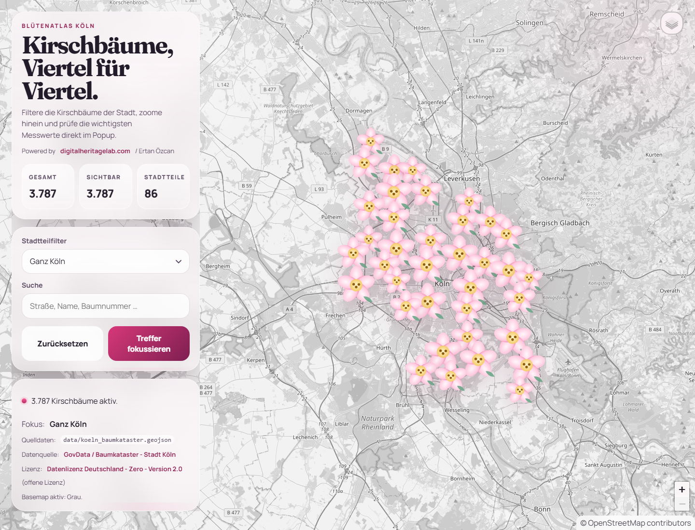
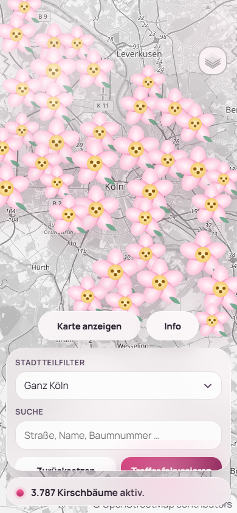

# BlütenAtlas Köln

## Deutsch

BlütenAtlas Köln ist eine leichte Web-App, die Kirschbäume in Köln auf einer interaktiven Karte zeigt.
Sie bietet Suche, Stadtteilfilter, Cluster-Ansicht und eine mobile Bedienoberfläche.

### Kurzüberblick

- Kirschbaum-Punkte auf der Karte
- Stadtteilfilter und schnelle Suche
- Cluster-Ansicht für bessere Übersicht
- Ausklappbares Bedienpanel auf Mobilgeräten
- Inhalte auf Basis offener Daten

### Screenshots

Desktop:



Mobil:



### Starten

Die Anwendung über einen statischen Server öffnen. Beispiel:

```bash
python -m http.server 8000
```

Danach `http://127.0.0.1:8000` im Browser öffnen.

### Hinweis

Die Kartenkacheln werden online geladen, daher ist eine Internetverbindung erforderlich.

## English

BlütenAtlas Köln is a lightweight web app that shows cherry trees in Cologne on an interactive map.
It includes search, district filtering, cluster view, and a mobile-friendly control panel.

### Quick Overview

- Cherry tree points on the map
- District filter and fast search
- Cluster view for easier navigation
- Collapsible control panel on mobile devices
- Content based on open data

### Screenshots

Desktop:


Mobile:


### Run

Open the app through a static server. Example:

```bash
python -m http.server 8000
```

Then open `http://127.0.0.1:8000` in your browser.

### Note

Map tiles are loaded online, so an internet connection is required.
